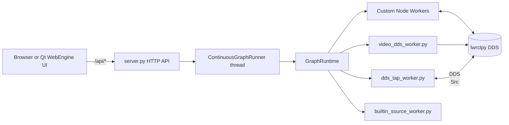
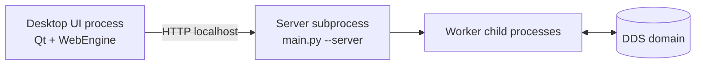

# lwrclpy Web Node Editor Architecture

This document describes the current architecture implemented in this repository.
It reflects the code paths in:

- `main.py`
- `lwrclpy_web_node_editor/server.py`
- `lwrclpy_web_node_editor/desktop_app.py`
- `lwrclpy_web_node_editor/graph.py`
- `lwrclpy_web_node_editor/runtime_exec.py`
- `lwrclpy_web_node_editor/static/app.js`
- worker modules (`node_worker.py`, `video_dds_worker.py`, `dds_tap_worker.py`, `builtin_source_worker.py`)

## 1. Runtime Modes

The entrypoint is `main.py` and supports these modes:

1. Web server mode (development or standalone server): `python main.py --host 127.0.0.1 --port 8765` or standalone binary with `--server`. This mode does not use Qt/PySide6.
1. Desktop mode (embedded Web UI via Qt WebEngine): `python main.py --desktop` (standalone binary default with no args). This mode requires PySide6 (Qt WebEngine).
1. Worker dispatch mode (internal): `--worker-node`, `--worker-video`, `--worker-dds-tap`, `--worker-builtin-source`.

## 2. High-Level Topology



Important design point:

- UI is control plane and visualization.
- DDS message processing is performed in worker processes, not in the browser.

## 3. Frontend / Backend Separation (Important)

This system is intentionally split into two planes:

1. Frontend plane (UI): Browser tab (server mode) or Qt WebEngine (desktop mode). Handles editing, graph wiring, run control, and visualization. Does not execute DDS callbacks and does not perform DDS pub/sub.
1. Backend plane (runtime): `server.py` + `graph.py` + worker processes. Owns lwrclpy runtime lifecycle, process lifecycle, and DDS pub/sub.

```mermaid
flowchart TB
  subgraph Frontend
    UI[Browser or Qt WebEngine]
  end

  subgraph Backend
    API[HTTP API server.py]
    Runner[ContinuousGraphRunner]
    Runtime[GraphRuntime]
    W1[Custom node worker(s)]
    W2[Video worker]
    W3[DDS tap worker]
    W4[Builtin source worker]
  end

  subgraph DDSDomain
    DDS[(DDS topics via lwrclpy)]
  end

  UI -->|HTTP localhost| API
  API --> Runner
  Runner --> Runtime
  Runtime --> W1
  Runtime --> W2
  Runtime --> W3
  Runtime --> W4
  W1 <--> DDS
  W2 --> DDS
  W3 <-- DDS
  W4 --> DDS
```

Consequence of this separation:

- If UI rendering is heavy, backend processing can continue.
- Run/stop authority stays server-side.
- Message delivery semantics are governed by DDS/runtime, not browser timers.

Note:

- If you run only `--server` and open from an external browser, Qt is not part of the runtime path.

## 4. Process Composition

### 4.1 Server mode process set

When started as `main.py --server` (or standalone `--server`):

1. Main server process:
   - HTTP API
   - `ContinuousGraphRunner` thread
   - runtime orchestration
2. Zero or more worker child processes:
   - one per custom node
   - optional video worker
   - optional builtin source worker
   - optional DDS tap worker

### 4.2 Desktop mode process set

Desktop mode adds one UI process and one server subprocess.



Desktop shutdown path:

1. UI requests `/api/force-stop`.
2. UI terminates server subprocess.
3. Server/runtime cleanup kills remaining framework workers.

### 4.3 Process inventory

| Process | Responsibility | Typical lifetime |
| --- | --- | --- |
| Browser tab / Qt WebEngine | Graph editing, user actions, rendering | Until user closes UI |
| Server process (`server.py`) | API, run loop control, runtime orchestration | Until app shutdown |
| Custom node worker (`node_worker.py`) | User callback execution, timer callbacks, DDS pub/sub | During run / node usage |
| Video worker (`video_dds_worker.py`) | Decode video frames and publish DDS images | While video source is active |
| DDS tap worker (`dds_tap_worker.py`) | Subscribe target DDS topics for viewers/monitoring | While taps are configured |
| Builtin source worker (`builtin_source_worker.py`) | Built-in source topic publication | While source nodes are active |

## 5. Inter-Process Communication Model

### 5.1 Communication channels

| From | To | Channel | Payload |
| --- | --- | --- | --- |
| Frontend | Server | HTTP (localhost) | Graph JSON, run/stop commands, parameter updates |
| Server | Workers | Subprocess launch + config files + env | Worker startup config, runtime options |
| Workers | Workers | DDS pub/sub via lwrclpy | ROS-like topic messages |
| Workers | Frontend (indirect) | Status/frame artifacts + server APIs | Node status, preview frames |
| Server | Frontend | HTTP JSON responses | Run state, node summaries, errors |

### 5.2 Control path vs data path

Control path is HTTP-driven and synchronous from UI perspective.

- Examples: `POST /api/ready`, `POST /api/start`, `POST /api/stop`, `POST /api/force-stop`, `GET /api/run-status`

Data path is DDS-driven and asynchronous between worker processes.

- Node output topics fan out to subscribers through DDS.
- UI never becomes a DDS relay node.

### 5.3 Runtime artifacts used for IPC support

- `.node_workers/`:
  - worker configs
  - worker logs
  - frame/status side artifacts consumed by server endpoints
- `.node_envs/`:
  - per-node Python environments for custom workers
- `.app_settings/server.lock` (non-frozen) or `<standalone_app_home>/server.lock` (frozen):
  - single-instance guard metadata

## 6. Desktop Mode Architecture

Desktop mode now uses process isolation:

1. `desktop_app.py` starts a dedicated server subprocess (`main.py --server ...`) on a free localhost port.
2. Qt WebEngine loads that local URL.
3. On desktop app shutdown, it requests `/api/force-stop`, then terminates the server subprocess.

This separation avoids coupling WebEngine UI stalls with server execution.

## 7. Single-Instance Server Guard

Server duplicate startup is rejected via a lock file.

- Non-frozen (python main.py):
  - lock path: `.app_settings/server.lock` under current project directory
- Frozen standalone:
  - lock path: `<standalone_app_home>/server.lock`

Startup behavior:

1. Try exclusive create (`O_EXCL`) lock file with PID/host/port metadata.
2. If lock exists and PID is alive, startup is rejected.
3. If lock exists but PID is stale, lock is removed and retried.

Shutdown behavior:

- Lock is released on normal shutdown and registered via `atexit` as fallback.

## 8. Run Lifecycle

### 8.1 Ready

`POST /api/ready`:

1. Stops runner and runtime.
2. Cleans stale framework workers.
3. Recreates `.node_envs` and `.node_workers`.
4. Prepares per-node environments and validates setup.
5. Stores payload signature for subsequent Run authorization.

### 8.2 Start

`POST /api/start`:

1. Validates payload signature (Ready required).
2. Starts `ContinuousGraphRunner` background thread.
3. Runner repeatedly executes `GraphRuntime.run(payload)`.

### 8.3 Status

`GET /api/run-status`:

- Returns compact node status and run metadata.
- Plot series are decimated for payload control.
- Image payloads are represented as frame references when possible.

### 8.4 Stop / Force Stop

`POST /api/stop`:

- Calls `runner.stop()`.
- Attempts runtime stop with bounded lock timeout.
- If runner reported `runner stop timed out`, server escalates to force-stop path.

`POST /api/force-stop`:

- Force stops runtime workers.
- Cleans orphan framework processes.

Client-side (`app.js`) stop behavior:

- Stop requests use `AbortController` timeout.
- If stop is pending/timed out, UI automatically escalates to force stop.

## 9. Worker Model

### 9.1 Custom nodes

- Each custom node runs in its own process with its own venv:
  - `.node_envs/<node-id>/...`
- Worker config and logs are in `.node_workers/`.

### 9.2 Built-in source worker

- Handles built-in source tools (for example, Function Generator/Image source paths) where applicable.

### 9.3 Video worker

- `video_dds_worker.py` decodes local video via OpenCV.
- Publishes DDS messages at source-driven timing.
- Writes latest preview/status into `.node_workers` files.

### 9.4 DDS tap worker

- `dds_tap_worker.py` subscribes to DDS topics for viewer/monitor tools.
- Produces status updates and latest-frame artifacts for UI retrieval.

## 10. Worker Launch Resolution

`runtime_exec.py` abstracts launch commands:

- Non-frozen: launch worker Python scripts directly from package directory.
- Frozen: prefer bundled worker scripts; if needed, dispatch through frozen executable worker flags.

This keeps worker startup portable across development and standalone builds.

## 11. Data Path vs Control Path

### Control path

- UI -> `/api/start`, `/api/stop`, `/api/force-stop`, `/api/run-status`, `/api/update-node-params`.

### Data path

- DDS traffic flows between worker processes.
- UI fetches display artifacts (status/frame) and does not execute DDS logic.

## 12. Image/Frame Display Pipeline

Image views are updated by frame references and per-node frame fetch API:

1. Worker writes latest frame artifact + metadata.
2. `run-status` includes `frameRef` metadata.
3. UI requests `/api/node-frame?nodeId=...` for actual frame bytes.
4. Canvas is updated in-place to avoid blank-frame flicker.

## 13. Frozen Runtime Specifics

When running as standalone binary:

1. App home is OS-specific (`standalone_app_home`).
2. `lwrclpy_site` is prepended to `sys.path`.
3. Latest `lwrclpy` wheel is auto-installed/updated at startup when possible.
4. Worker imports get compatibility alias `builtins.__orig_import__` for embedded PySide/shiboken paths.

## 14. Build and Packaging Model

Supported scripts:

- Linux: `scripts/build_linux_standalone.sh`
- macOS: `scripts/build_macos_standalone.sh`
- Windows: `scripts/build_windows_standalone.ps1`

All produce PyInstaller `onedir` bundles on their native OS.
Cross-OS artifact generation is not supported in this repository workflow.

## 15. Known Operational Guardrails

1. Run `Ready` before `Run`; server enforces signature match.
2. Only one server instance per working context due lock guard.
3. If UI appears stuck at stopping, force-stop escalation path should recover without indefinite wait.
4. Keep only one active server target (avoid running development and standalone servers simultaneously against the same workspace).
