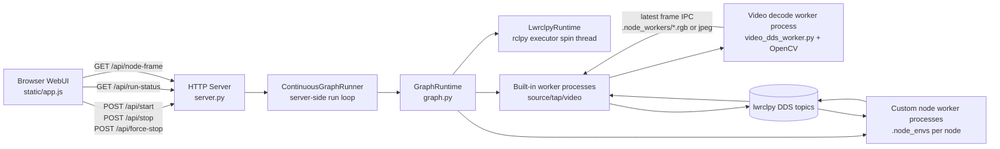
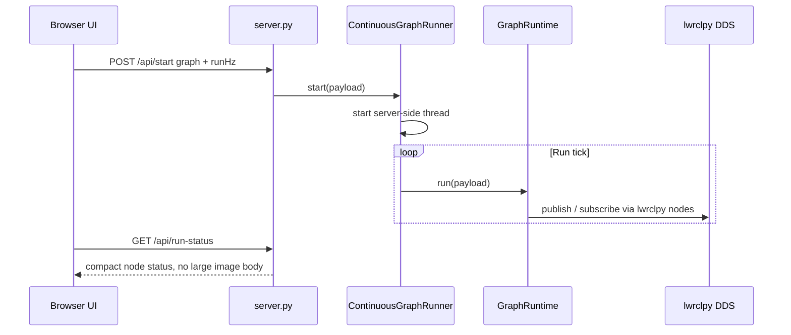
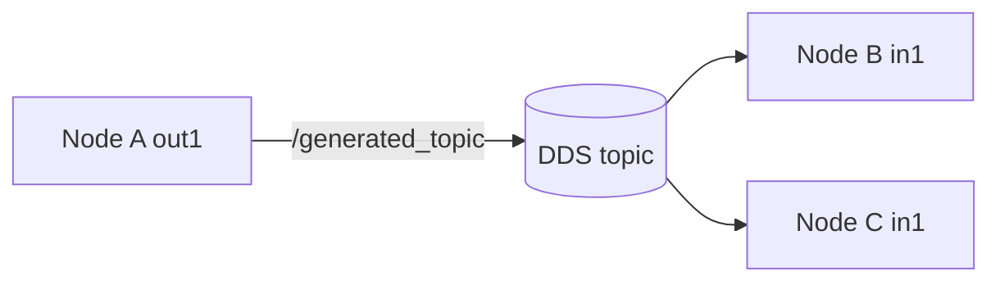
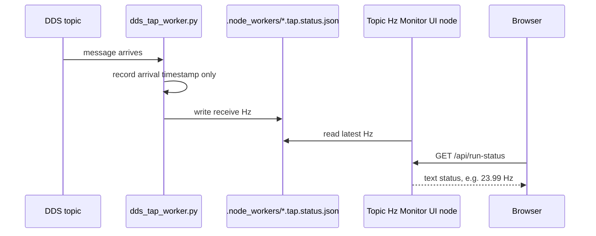
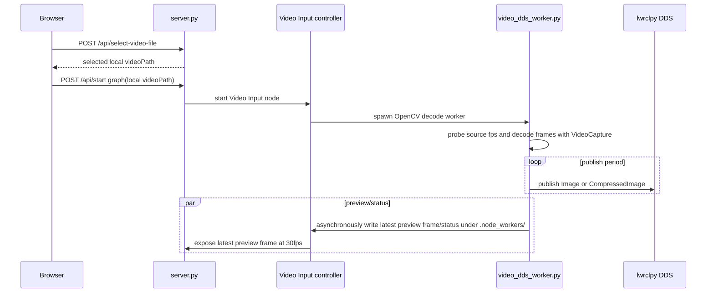
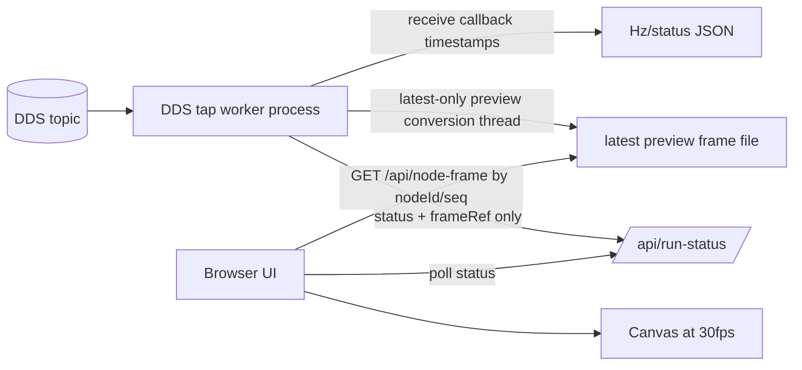

# DDS Backend and Frontend Architecture

このドキュメントは、`lwrclpy Web Node Editor` の現在のDDS通信バックエンドとWebフロントエンドの構成を説明します。対象実装は主に次のファイルです。

- `lwrclpy_web_node_editor/static/app.js`
- `lwrclpy_web_node_editor/server.py`
- `lwrclpy_web_node_editor/graph.py`
- `lwrclpy_web_node_editor/video_dds_worker.py`

## 全体像

WebUIはノードグラフの編集、Run/Stop操作、表示更新を担当します。実際のノード実行、DDS publish/subscribe、動画デコードはバックエンド側で動作します。



重要な点は、グラフ内のデータフローはWebUI上の直接データ受け渡しではなく、バックエンドのlwrclpy topicを経由する設計になっていることです。WebUIは状態確認と表示を行うだけで、DDSの通信周期を直接駆動しません。

## プロセスとスレッド

現在の実行単位は次の通りです。

| 対象 | 実行単位 | 主な役割 |
| --- | --- | --- |
| Web server | 1プロセス | HTTP API、静的ファイル配信、Run制御 |
| `ContinuousGraphRunner` | server内thread | Run中のグラフtickをサーバー側で継続実行 |
| built-in source worker | producerノード別プロセス | Function Generator、Image File InputのDDS publish |
| DDS tap worker | sink/viewerノード別プロセス | Image View、Topic Hz Monitor、Graph View、Image File SaveのDDS receive |
| custom node | node別プロセス | ユーザー作成ノード。`.node_envs/<node-id>` のvenvを使う |
| Video decode worker | Video Input別プロセス | OpenCVでローカル動画をデコードし、DDS publishとpreview frame IPCを行う |

カスタムノードはノードごとに別venv、別プロセスで動きます。built-inノードもTopic Input/Outputのような境界ノードを除き、DDS publish/receiveをserverプロセス内で行いません。Function GeneratorとImage File Inputは `builtin_source_worker.py`、Image View/Topic Hz Monitor/Graph View/Image File Saveは `dds_tap_worker.py`、Video Inputは `video_dds_worker.py` の独立プロセスで動きます。

## Run制御

Runボタンを押すと、WebUIは `/api/start` に現在のグラフを送ります。以後、Runループはブラウザではなくサーバー側で動作します。



Stopは `/api/stop` です。Force Stopは `/api/force-stop` で、管理中のworker processに加えて、このフレームワークが作成した残留worker processも探索してkillします。

## DDS通信モデル

リンク接続はtopic名に変換されます。1つの出力ポートから複数の入力へ接続した場合、その出力ポートのtopic名は1つに同期されます。



`Topic Input` と `Topic Output` はグラフ境界を表すノードです。これら自体がデータ処理を行うのではなく、接続された処理ノードまたは表示ノードが実際のSub/Pubを持ちます。

### rclpy互換API方針

このプロジェクトのWebプレビュー実行系とエクスポートコードは、rclpy互換APIに寄せます。

- publishは `msg = MessageType(); ...; publisher.publish(msg)` の通常経路だけを使います。
- subscribeは `create_subscription(..., callback, qos)` のcallback経路だけを使います。
- Webプレビュー、custom node worker、Video DDS workerでは、`loan_message()`、`loaned_take()`、DataSharing制御APIなどのlwrclpy固有ゼロコピーAPIは使いません。
- ROS 2パッケージ/単体Pythonとしてエクスポートするコードも、標準ROS 2 `rclpy` APIだけを使います。

`sensor_msgs/msg/Image` は表示・変換・ブラウザ転送のどこかで必ずコピーが発生するため、ゼロコピー対応は前提にしません。性能改善は、DDS受信処理と表示処理の分離、表示fpsの制限、Hz Monitorで画像本体を保持しないことに集中します。

### Subscriber callbackとHz Monitor

DDS subscriber callbackでデータを受信すると、DDS tap workerプロセス内で最新状態だけを更新します。Hz Monitorでは画像本体やメッセージ本体を保持せず、受信時刻のリングバッファだけを使います。Image Viewでは最新フレームだけを表示変換workerへ渡し、古いフレームは捨てます。

`Topic Hz Monitor` はWebUIの描画fpsではなく、DDS tap workerプロセス内のsubscriber callback到着時刻からHzを計算します。server.pyはworkerが書いたstatus JSONを読むだけで、DDS受信callbackを実行しません。



## Video Inputの設計

Video Inputは、ブラウザから毎フレーム画像をHTTP送信する方式ではありません。また、動画ファイルをブラウザからサーバへアップロードする方式も使いません。WebUIの `Select Video` はサーバ側でファイル選択ダイアログを開き、選択されたローカルファイルパスをVideo Input設定に保存します。Path欄は表示専用で、直接入力はできません。



### Imageが標準、CompressedImageは性能オプション

動画の標準出力型は `sensor_msgs/msg/Image` です。ユーザーが特に指定しない限り、Video Inputは非圧縮の通常ImageをDDS publishします。

ユーザーがVideo Inputの出力ポート型を `sensor_msgs/msg/CompressedImage` に変更した場合だけ、workerがJPEGフレームを生成し、`sensor_msgs/msg/CompressedImage` としてDDS publishします。

raw `sensor_msgs/msg/Image` は扱いやすく標準的です。一方で、Python経由で高解像度・高fpsのraw画像をpublish/subする場合は、メッセージコピーとserializeのコストが大きくなります。性能が必要な動画用途では、ユーザーが明示的にCompressedImageを選択できます。

画像/動画topicのQoSは、rclpy互換APIの範囲で `BEST_EFFORT + KEEP_LAST(1)` を使います。Image ViewやHz Monitorは表示・監視用途であり、古いフレームを溜めて処理する必要がありません。ここをdefault reliable/depth 10にすると、Image Viewのような遅いreaderがpublisherにbackpressureをかけ、DDS publish周期やHz Monitorの表示値まで低下します。

### 動画fpsとLoop

Video Inputは動画ファイルのsource fpsを使ってpublishします。OpenCV probeで取得した `sourceFps` がworker statusに入り、server側publish周期にも使われます。フレーム読み込み、DDS publish、preview生成にかかった処理時間も含めて、絶対時刻ベースで次のpublish時刻を決めます。

`loop=false` の場合、workerは動画終端で `ended=true` をstatusに書きます。Video Input側は `ended=true` を検出するとworkerを再起動せず、最後のフレームを再publishしません。

## Image Viewの表示経路

Image ViewはDDSで受信した画像を表示します。ただし、画像本体を `/api/run-status` のJSONへ毎回入れると、JSON生成、base64、HTTP、ブラウザdecodeが重くなり、DDS callbackにも悪影響が出ます。

そのため現在は、run-statusには画像本体ではなく `frameRef` だけを入れます。Image Viewは `frameRef` のseqを見て、必要な最新preview frameだけを `/api/node-frame` で取得してcanvasへ描画します。MJPEG `` streamはブラウザ内部バッファを制御しにくいため使いません。



`/api/run-status` は軽量な状態確認APIです。画像本体の転送はrun-statusから分離されます。DDS callbackは受信時刻と最新msg参照だけを更新し、表示用JPEG生成はDDS受信callbackとは別スレッドで最新フレームだけを処理するため、古いフレームがキューに溜まり続けない設計です。

## Frontendの役割

`static/app.js` の主な役割は次の通りです。

- ノードグラフの編集
- プロジェクトの保存/読み込み
- Run/Stop/Force StopのAPI呼び出し
- `/api/run-status` のポーリング
- Image Viewのlatest-frame canvas表示
- Video Inputのworkerプレビュー

Video Inputのプレビューは、Video workerがデコードした最新フレームを `.node_workers/` に軽量previewとして書き、ブラウザが軽量な画像表示経路で表示します。DDS publishとプレビュー生成は同じworker内の同じデコードフレームから分岐しますが、プレビュー書き込みは別スレッドで最新フレームのみ保持するため、表示遅延がDDS publishをブロックしない設計です。

## Backend API

主なAPIは次の通りです。

| API | 用途 |
| --- | --- |
| `POST /api/start` | server-side Runを開始 |
| `POST /api/stop` | Run停止、通常worker停止 |
| `POST /api/force-stop` | Run停止、worker強制kill、残留プロセス掃除 |
| `GET /api/run-status` | 軽量なノード状態取得 |
| `GET /api/node-frame?nodeId=<id>` | Image View/Video preview用の最新preview frame取得 |
| `POST /api/update-node-params` | Run中の動画path、loopなどのruntime parameter更新 |

## データ形式

### Video Input default

標準の動画DDS出力:

```text
sensor_msgs/msg/Image
width: uint32
height: uint32
encoding: "rgb8"
step: width * 3
data: RGB bytes
```

### Compressed image option

ユーザーがCompressedImageを選択した場合:

```text
sensor_msgs/msg/CompressedImage
format: "jpeg; width=<w>; height=<h>"
data: JPEG bytes
```

raw画像は扱いやすい一方で、Python経由のDDS publish/subではデータ量の影響を強く受けます。動画の連続フレームで性能が必要な場合はCompressedImageを選択できます。

## 性能上の分離

現在の分離ポイントは次の通りです。

- DDS subscriber callbackはlwrclpy executor spin threadで受信します。
- built-in表示ノードは30fpsで表示用状態だけを更新します。
- Image Viewの画像本体はrun-statusから分離され、`/api/node-frame` で最新preview frameだけを取得します。
- 動画デコードはserver本体ではなく `video_dds_worker.py` の別プロセスで実行します。
- カスタムノードはnode別venv、node別プロセスで実行します。

重いraw画像をPythonで大量にpublish/subする場合は、プロセス分離していてもメッセージコピーとserializeの影響を受けます。必要に応じてCompressedImageを選択することで、この負荷を下げられます。

## 障害時の見方

### Topic Hz Monitorが低い

まず確認する点:

- raw `sensor_msgs/msg/Image` で高解像度・高fpsを流していないか
- 必要に応じてVideo Inputの出力型を `sensor_msgs/msg/CompressedImage` に変更しているか
- Video Inputのsource fpsが想定通り取得されているか
- `/api/run-status` が巨大化していないか

### Video previewは止まるがDDSが止まらない

プレビューとDDS出力は別実行主体です。loop設定はWebUIからserver側runtime paramsへ送られ、worker statusの `ended=true` によってDDS出力停止が判断されます。Run中にloopを変更した場合は `/api/update-node-params` でserverへ反映されます。

### 画像表示がカクつく

Image ViewはDDS受信自体とは別に、preview JPEG生成とcanvas描画速度に依存します。Hz Monitorが正しい値ならDDS受信は成立しており、問題は表示側です。
