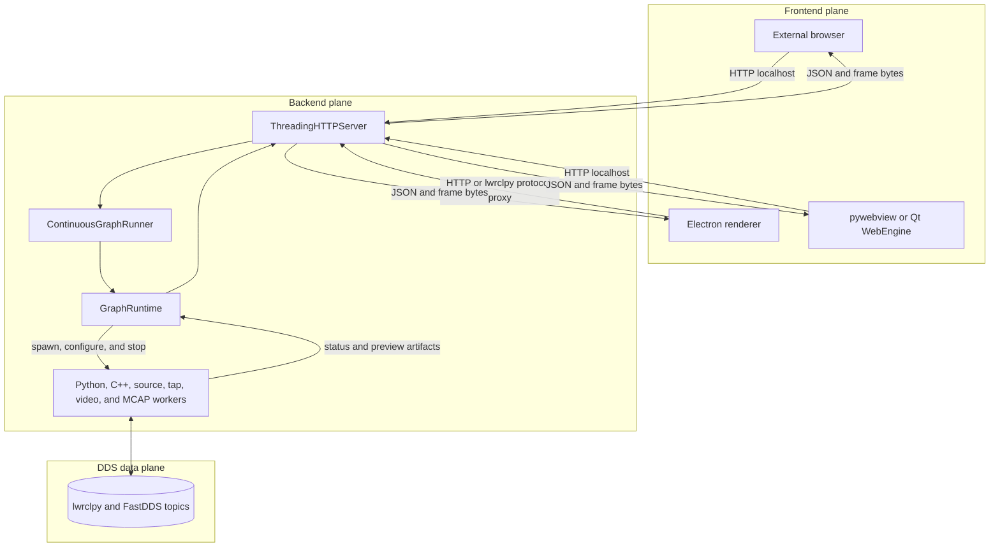
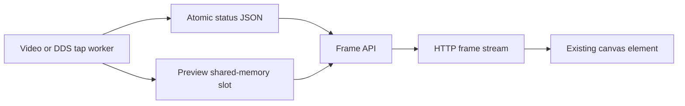

# lwrclpy Web Node Editor Architecture

This document describes the architecture currently implemented in this repository. It is intended for contributors working on the editor, runtime, workers, or standalone packages.

## 1. System Overview

The application has four main layers:

1. A browser-based graph editor.
2. A local Python HTTP server.
3. A graph runtime that owns node and process lifecycles.
4. Worker processes that exchange messages through `lwrclpy` / FastDDS.

The browser is the control and visualization plane. DDS callbacks and graph data processing do not run in the browser.



## 2. Entrypoints and Runtime Modes

`main.py` is the Python and frozen-backend entrypoint.

| Mode | Invocation | Purpose |
| --- | --- | --- |
| Source server | `python main.py --host ... --port ...` | HTTP server opened in an external browser |
| Explicit server | `python main.py --server ...` | Backend mode used by desktop shells |
| Python desktop | `python main.py --desktop` | Starts a server subprocess and embeds its UI with pywebview or PySide6 |
| Frozen desktop backend | Frozen executable with no arguments | Enters Python desktop mode |
| CLI runtime | `--cli-run` | Runs an exported graph without the Web UI |
| Internal worker dispatch | `--worker-*` | Runs a bundled worker from the frozen executable |

The packaged desktop application normally uses `electron/main.js` as its outer process. Electron launches the frozen Python backend with `--server`.

## 3. Frontend Variants

### 3.1 External browser

The source server exposes static files and `/api/*` on a localhost HTTP port. Any modern browser can load the editor directly.

### 3.2 Electron desktop shell

The standalone build packages:

- an Electron main process and renderer;
- a PyInstaller `onedir` Python backend;
- static UI files, samples, worker modules, and runtime dependencies.

Electron selects a free localhost port, launches the backend, waits for `/api/health`, and creates a `BrowserWindow`.

On Windows, the renderer uses the privileged `lwrclpy://app/` scheme. Electron proxies those requests to the localhost backend. This keeps the renderer on a stable origin while the backend port changes for each launch. Other platforms normally load the backend URL directly.

Windows Electron builds disable hardware acceleration and use the configured software-rendering path. This is isolated to the Electron shell and does not change graph or DDS execution.

### 3.3 Python desktop shell

`desktop_app.py` is a separate desktop path:

1. Kill an older editor server and stale workers.
2. Select a free port.
3. Launch `main.py --server` as a subprocess.
4. Wait for `/api/health`.
5. Open pywebview when available.
6. Fall back to PySide6 Qt WebEngine where supported.

The UI process never hosts `GraphRuntime`; the server remains a separate process.

## 4. Server Layer

`lwrclpy_web_node_editor/server.py` owns:

- `ReusableThreadingHTTPServer`;
- static asset and sample-project delivery;
- graph project APIs;
- Ready, Run, update, and Stop APIs;
- frame retrieval and streaming;
- CLI and ROS 2 package export;
- server and worker cleanup;
- the single-server lock.

`ReusableThreadingHTTPServer` uses daemon request threads and does not block process shutdown on long-lived frame requests.

Server-side file selection is platform-specific:

- macOS uses `osascript`.
- WSL uses Windows Forms through `powershell.exe`, then converts the selected path with `wslpath`.
- Other Linux environments and non-macOS source environments use Tk when available.

Important API groups:

| API | Responsibility |
| --- | --- |
| `GET /api/health` | Backend readiness and lwrclpy status |
| `POST /api/ready` | Prepare environments and workers without starting the run loop |
| `POST /api/start` | Start continuous execution after a matching Ready |
| `POST /api/run` | Execute one graph run operation |
| `POST /api/update-run-payload` | Replace the active run payload |
| `POST /api/update-node-params` | Update live node parameters |
| `GET /api/run-status` | Return compact run and node state |
| `GET /api/node-frame` | Return one preview frame |
| `GET /api/node-frame-stream` | Stream preview frames over one HTTP response |
| `POST /api/stop` | Stop the runner and all owned workers |

## 5. Graph Runtime

`GraphRuntime` in `graph.py` converts the graph JSON into `CustomLwrclNodeConfig` and `CustomLwrclNodeInstance` objects.

Its responsibilities are:

- validate node definitions and topic connections;
- prepare per-node Python environments;
- generate and compile C++ nodes;
- create worker configuration files;
- start and monitor worker processes;
- collect status and viewer output;
- stop workers and release resources;
- retain the latest graph state for status APIs.

`ContinuousGraphRunner` owns the server-side run thread. Browser timer throttling therefore does not stop graph execution when the browser loses focus.

## 6. Ready and Run Lifecycle

### 6.1 Ready

`POST /api/ready` computes a setup signature from fields that affect the runtime environment, including implementation language, requirements, Python/lwrclpy versions, imports, and port types.

When preparation is required:

1. Stop the current runner.
2. Force-stop the current runtime.
3. Kill stale framework workers.
4. Recreate `.node_workers`.
5. Create or update Python node environments.
6. Generate and configure C++ workspaces.
7. Validate that workers can be prepared.
8. Store the Ready signature only after successful preparation.

Repeated Ready requests with the same signature reuse the prepared state when no run is active.

### 6.2 Start

`POST /api/start` is accepted only when its signature matches the successful Ready signature.

Before starting:

1. Clear stale image references.
2. Kill framework workers left from a prior run.
3. Start `ContinuousGraphRunner`.
4. Let `GraphRuntime` start exactly the workers required by the current graph.

### 6.3 Live updates

Graph payload and node parameter updates are sent to the server. Workers are reused when their signatures are unchanged and restarted when their executable configuration changes.

### 6.4 Stop

Stop is server-owned:

1. Stop the continuous runner.
2. Stop every runtime node.
3. Terminate worker processes.
4. Escalate to forced termination when graceful shutdown times out.
5. Clean remaining framework worker PIDs.

MCAP record workers receive a graceful termination opportunity so that recordings can be finalized before forced cleanup.

## 7. Worker Types

| Worker | Module or source | Responsibility |
| --- | --- | --- |
| Python custom node | `node_worker.py` | User callbacks, timers, loop code, DDS pub/sub |
| C++ custom node | Generated under `.node_workers/cpp/` | Compiled `lwrcl` node and DDS pub/sub |
| Built-in source | `builtin_source_worker.py` | Function generators and applicable built-in publishers |
| Video source | `video_dds_worker.py` | OpenCV decode, source-timed DDS publication, preview production |
| DDS tap | `dds_tap_worker.py` | Viewer and monitor subscriptions, status and preview production |
| MCAP recorder | `mcap_record_worker.py` | Topic recording and per-topic recorder child management |

`runtime_exec.py` resolves worker commands:

- source mode runs worker scripts with the selected Python executable;
- frozen mode dispatches through `--worker-*` flags;
- a per-node Python executable can still run a bundled worker script when needed.

## 8. Python Node Environments

Each Python custom node has an isolated environment:

```text
.node_envs/<node-id>/
```

The environment signature includes the requested Python version, requirements, selected lwrclpy release or local wheel, imports, and message types.

`uv` is preferred for environment creation and package installation. The standard `venv` and `pip` path is available as a fallback where implemented.

A local wheel selected with `--lwrclpy-wheel` is propagated to the server and node environments through `LWRCLPY_LOCAL_WHEEL`.

## 9. C++ Node Pipeline

C++ nodes are generated by `cpp_codegen.py` and managed by `GraphRuntime`.

```text
.node_workers/cpp/<node-id>/
  CMakeLists.txt
  <generated-package>/
    CMakeLists.txt
    src/<generated-node>.cpp
  build/
```

The build pipeline:

1. Convert node ports and code fields into generated C++ source.
2. Generate a CMake workspace.
3. Resolve CMake from the Python package, bundled tools, or `PATH`.
4. Search configured `lwrcl` and DDS prefixes.
5. Configure and build in Release mode.
6. Cache a signature of code, ports, links, topics, and run rate.
7. Launch the executable as a worker.

Prefix discovery includes bundled dependencies and:

- `LWRCL_PREFIX`
- `LWRCL_FASTDDS_PREFIX`
- `FAST_DDS_PREFIX`
- `DDS_PREFIX`
- `CPP_DEP_PREFIXES`
- `CMAKE_PREFIX_PATH`
- platform default prefixes

Build output is written to `.node_workers/<node-id>.cpp.log`.

## 10. Communication and Artifacts

### 10.1 Control plane

The UI sends JSON over HTTP. The server starts processes and writes worker configuration files. Workers publish status through atomic JSON files.

### 10.2 Graph data plane

Node-to-node graph data uses DDS topics through `lwrclpy` or native C++ `lwrcl`. The server and browser are not relays for graph messages.

### 10.3 Runtime files

`.node_workers/` contains:

- worker configuration JSON;
- PID files;
- atomic status JSON;
- logs;
- preview fallbacks;
- generated C++ projects and binaries.

Writes shared between workers and the server use helpers in `atomic_file.py` to avoid partial JSON or byte reads.

## 11. Preview Pipeline

Preview transport is separate from the DDS graph data plane.



The current path is:

1. A video or DDS tap worker writes the latest preview frame to a named shared-memory slot.
2. Its status advertises `streamName`, dimensions, encoding, sequence, and stream identity.
3. `GraphRuntime` returns a lightweight `frameRef` in run status.
4. The browser opens `/api/node-frame-stream?nodeId=...`.
5. The server reads a stable frame by comparing the shared-memory header before and after the data copy.
6. Length-prefixed frame records are drawn into the existing canvas.

`/api/node-frame` remains the single-frame and file-backed fallback. Stream request access logs are suppressed for successful responses because the requests are expected runtime traffic.

Preview shared memory is an application-local display optimization. It is not the FastDDS shared-memory transport and does not alter DDS message semantics.

## 12. Process Ownership and Cleanup

The intended invariant is one active editor server and only its current worker descendants.

### 12.1 Startup cleanup

Before binding the server port, `cleanup_previous_runtime_processes()`:

1. finds prior editor server processes;
2. finds framework worker processes from PID files and command lines;
3. protects the current process family;
4. force-terminates stale targets;
5. removes stale lock state.

This is replacement behavior, not a port retry loop. Starting a new editor server removes the old editor server and its workers.

### 12.2 Lock file

After cleanup, the server acquires an exclusive lock containing PID, host, and port metadata.

- Source mode: `.app_settings/server.lock`
- Frozen mode: `<standalone-app-home>/server.lock`

The lock prevents a startup race after old processes have been removed.

### 12.3 Windows Job Object

On Windows, `windows_job.py` creates a Job Object with `JOB_OBJECT_LIMIT_KILL_ON_JOB_CLOSE`.

- The server process joins the Job.
- Spawned workers are explicitly assigned to it.
- Closing or forcibly terminating the server closes the Job and terminates descendants.

PID and command-line cleanup remains as startup and shutdown recovery for processes from older runs or failed assignment.

### 12.4 Linux and macOS

Workers are launched in their own process sessions where applicable. Runtime stop and cleanup terminate process trees using recorded PIDs and framework-specific command matching.

### 12.5 Desktop shutdown

Electron and `desktop_app.py` both request backend stop, then terminate the backend if it does not exit promptly. The backend's own shutdown path stops `GraphRuntime`, workers, and the HTTP server.

## 13. FastDDS Runtime Configuration

Workers set FastDDS transport environment before importing `lwrclpy`.

- `LWRCLPY_WEB_FASTDDS_TRANSPORTS` controls external-topic workers where supported.
- `LWRCLPY_WEB_INTERNAL_FASTDDS_TRANSPORTS` controls the editor's internal worker traffic.
- The internal fallback is `UDPv4`.
- A bundled `resources/fastdds.xml` can be selected for standalone execution.

These settings are applied in worker processes so importing the Web UI or server does not initialize unrelated DDS participants.

## 14. Persistence and Export

Project persistence is JSON-based. Custom node definitions are stored under `.app_settings/custom_nodes`.

The server can generate:

- a CLI runner package containing the graph runtime and required workers;
- a ROS 2 Python package;
- generated C++ workspaces and `build_cpp_nodes.sh` when C++ nodes are present.

CLI execution uses `cli_run.py` and the exported `cli_export_runner.py` without serving the Web UI.

## 15. Standalone Packaging

Native build scripts are:

- `scripts/build_linux_standalone.sh`
- `scripts/build_macos_standalone.sh`
- `scripts/build_windows_standalone.ps1`

Each build is produced on its target OS. The scripts:

1. build a PyInstaller `onedir` backend;
2. verify backend imports;
3. bundle worker modules, static files, samples, and runtime data;
4. optionally bundle C++ prefixes;
5. package the backend as an Electron resource.

Standalone writable state is stored under:

| Platform | Default app home |
| --- | --- |
| Linux | `~/.local/share/lwrclpy-web-node-editor` |
| macOS | `~/Library/Application Support/lwrclpy-web-node-editor` |
| Windows | `%APPDATA%\lwrclpy-web-node-editor` |

`LWRCLPY_WEB_NODE_EDITOR_HOME` overrides this location.

The frozen runtime can install or update `lwrclpy` under its writable `lwrclpy_site` directory. A bundled runtime remains available when auto-update is unavailable or fails.

## 16. Source Map

| Path | Responsibility |
| --- | --- |
| `main.py` | Mode selection, frozen setup, worker dispatch |
| `electron/main.js` | Electron lifecycle, backend launch, Windows proxy |
| `desktop_app.py` | pywebview/PySide desktop lifecycle |
| `server.py` | HTTP API, runner, process cleanup, export |
| `graph.py` | Graph model, environment setup, worker and C++ lifecycle |
| `runtime_exec.py` | Source/frozen worker command resolution |
| `windows_job.py` | Windows descendant lifetime enforcement |
| `atomic_file.py` | Atomic status and artifact writes |
| `cpp_codegen.py` | Generated C++ source and CMake |
| `node_worker.py` | Python custom-node runtime |
| `builtin_source_worker.py` | Built-in DDS publishers |
| `video_dds_worker.py` | Video decode, DDS publish, preview |
| `dds_tap_worker.py` | DDS subscriptions and viewers |
| `mcap_record_worker.py` | MCAP recording |
| `static/app.js` | Graph editor, API client, preview rendering |

## 17. Architectural Invariants

1. The browser does not execute user callbacks or participate directly in DDS.
2. Ready must succeed for the exact setup signature before Start.
3. Graph messages travel through DDS, not through browser polling.
4. Preview shared memory is separate from DDS transport.
5. Starting a new server removes the prior editor server and stale workers.
6. Server termination must terminate owned worker descendants.
7. Python custom nodes remain isolated by node environment.
8. C++ workers are rebuilt only when their build signature changes.
9. Standalone writable state is outside the installed application bundle.
